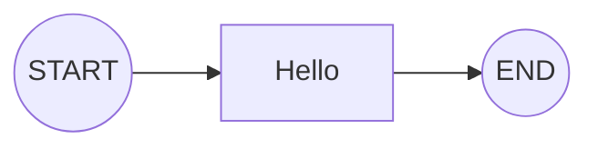

# SAA Graph Composer

[](https://codecov.io/github/chrisis58/saa-graph-composer) [](LICENSE)

SAA Graph Composer 是 Spring AI Alibaba Graph 的声明式编排扩展，将复杂的底层流式构建转化为优雅的注解驱动开发。

[📚 在线文档](https://chrisis58.github.io/saa-graph-composer/) | [🚀 快速开始](https://chrisis58.github.io/saa-graph-composer/guide/getting-started.html)

## 💡 为什么需要它？

在使用原生 Spring AI Alibaba Graph 开发复杂的 Agent 流程时，你可能会面临以下工程挑战：

- **构建逻辑繁琐**：大量的 `builder.addNode()` 和 `builder.addEdge()` 过程式代码堆叠在构建方法中，导致核心业务流程难以直观呈现，维护成本高。
- **关注点混合**：节点的具体业务逻辑与图的结构定义交织在一起，既降低了代码的可读性，也增加了复用难度。
- **集成体验非原生**：缺乏对 Spring 容器的深度支持，无法像管理普通 Service Bean 那样便捷地进行自动装配与配置注入。

## 核心特性

1. **声明式开发**：通过注解直观定义节点职责与流转路径，而无需在代码中堆砌 `addNode()` 和 `addEdge()`。
2. **Spring 深度集成**：遵循 Spring 标准开发模式。图定义类与编译后的图实例均被托管为标准 Bean，支持原生依赖注入与配置。
3. **灵活的混合构建**：针对复杂的动态连线，可通过生命周期钩子访问底层 API 补全逻辑，实现静态定义与动态构建的结合。
4. **多样的编译方式**：既支持通过 `@EnableGraphComposer` 自动扫描注册，也支持在不启动 Spring 上下文的情况下利用 `IGraphBuilder` 手动构建。

通过 `@GraphComposer` 定义蓝图，告别繁琐的手动构建：

```java
@GraphComposer
public class HelloGraphComposer {

    @GraphKey
    public static final String KEY_GREETING = "greeting";

    @GraphNode(id = "hello", isStart = true, next = StateGraph.END)
    final NodeAction helloAction = state -> 
        	Map.of(KEY_GREETING, "Hello, Graph Composer!");
}
```

对应生成的拓扑结构：



## 🤝 与 Spring AI Alibaba 的关系

SAA Graph Composer **不是** 替代品，而是 **增强包**。

- 它的底层完全基于 Spring AI Alibaba 的 `StateGraph` 构建。
- 生成的 `CompiledGraph` 是原生的对象，你可以无缝使用原生的所有功能（如 `invoke`, `stream`）。
- 你可以随时通过 `GraphBuildLifecycle` 访问到底层 API。

---

<div align=center> 
💬任何使用中遇到的问题、希望添加的功能，都欢迎提交 issue 交流！<br />
⭐ 如果这个项目对你有帮助，请给它一个星标！<br /> <br /> 
</div>