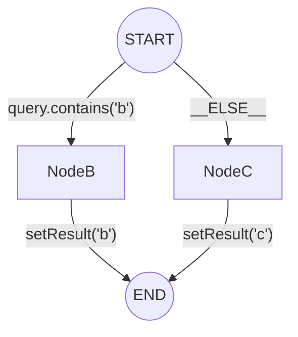

# SAA Graph Composer

[](https://codecov.io/github/chrisis58/saa-graph-composer)

SAA Graph Composer 是 Spring AI Alibaba Graph 的声明式编排扩展。

## ✨ 核心特性

### 🔌 节点即适配器 (Node as Adaptor) 将 Composer 作为纯粹的路由层，编排逻辑与业务实现自然解耦。

### 🧩 代码即图表 (Code as Graph) “所见即所得”的开发体验，像阅读流程图一样阅读代码。

### 🍃 非侵入式原生扩展 基于 Spring 标准生命周期构建，完全兼容官方 API，无缝共存。

## 📦 安装

👉 查看详细安装指南


```java
@GraphComposer
public class HelloGraphComposer {

    @GraphKey
    public static final String KEY_GREETING = "greeting";

    @GraphNode(id = "hello", isStart = true, next = StateGraph.END)
    final NodeAction helloAction = state -> 
            Map.of(KEY_GREETING, "Hello, Graph Composer!");

}
```

### 2. 逻辑可视化 (What You Think)

**对应的业务拓扑结构**。上述代码对应以下 Mermaid 流程图。



### 3. 等效代码 (What You Saved)

**这是你不必写的代码**。如果不使用本库，要在原生 Spring AI Alibaba Graph 中实现相同功能，你需要手动编写以下所有代码：

```java
@Configuration
public class ManualGraphConfiguration {

    @Bean("routedGraphCompiled")
    public CompiledGraph buildRoutedGraph() throws GraphStateException {
        StateGraph builder = new StateGraph(() -> Map.of(
                "query", new ReplaceStrategy(),
                "result", new ReplaceStrategy()
        ));

        AsyncNodeAction nodeBAction = state -> 
            CompletableFuture.completedFuture(Map.of("result", "b"));
            
        AsyncNodeAction nodeCAction = state -> 
            CompletableFuture.completedFuture(Map.of("result", "c"));

        builder.addNode("nodeB", nodeBAction);
        builder.addNode("nodeC", nodeCAction);

        builder.addEdge("nodeB", StateGraph.END);
        builder.addEdge("nodeC", StateGraph.END);

        AsyncEdgeAction condition = state -> {
            String query = (String) state.value("query").orElseThrow();
            String routeKey = query.contains("b") ? "b" : "c";
            return CompletableFuture.completedFuture(routeKey);
        };

        Map<String, String> routeMapping = Map.of(
                "b", "nodeB",
                "c", "nodeC"
        );

        builder.addConditionalEdges(StateGraph.START, condition, routeMapping);

        return builder.compile();
    }
}
```
